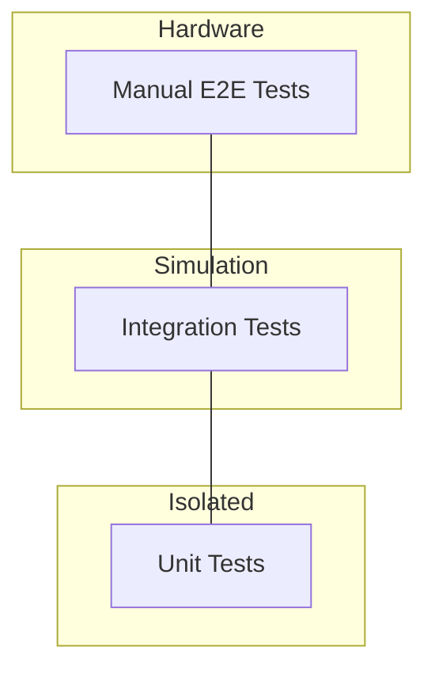

# Testing Strategy for Alpha HWR

## Overview

This document describes the testing strategy for the alpha-hwr library, designed to ensure reliability and maintainability, and to serve as a reference for other language implementations.

## Testing Pyramid




## Test Categories

### 1. Unit Tests (Fast, Isolated)

**Purpose**: Test individual components in isolation without external dependencies.

**Location**: `tests/unit/`

**Characteristics**:
- No BLE/Bluetooth dependencies
- No asyncio event loops (unless testing async code in isolation)
- Fast execution (< 0.1s per test)
- High coverage of edge cases

**Examples**:
```python
# tests/unit/protocol/test_codec.py
def test_encode_float_be():
    """Test big-endian float encoding."""
    result = encode_float_be(1.5)
    assert result == bytes.fromhex("3FC00000")


def test_decode_float_be_inf():
    """Test handling of infinity values."""
    result = decode_float_be(bytes.fromhex("7F800000"))
    assert math.isinf(result)


# tests/unit/protocol/test_frame_builder.py
def test_build_class10_read():
    """Test building Class 10 READ frame."""
    frame = FrameBuilder.build_class10_read(0x5D012C)
    assert frame[0] == 0x27  # Start byte
    assert frame[4] == 0x0A  # Class 10
    # Verify CRC
    assert verify_crc(frame)
```

### 2. Integration Tests with Mock Pump

**Purpose**: Test full client workflows against a simulated pump without hardware.

**Location**: `tests/integration/`

**Characteristics**:
- Uses `MockPump` to simulate hardware
- Tests complete workflows (connect → authenticate → command → response)
- Tests error handling and edge cases
- Moderate execution time (0.5-2s per test)

**Examples**:
```python
# tests/integration/test_client_workflows.py
@pytest.mark.asyncio
async def test_read_telemetry_workflow():
    """Test complete telemetry reading workflow."""
    pump = MockPump()
    await pump.connect()
    await pump.authenticate()

    client = AlphaHWRClient(pump_address="MOCK")
    client.transport = MockTransport(pump)  # Inject mock

    await client.connect()
    telemetry = await client.telemetry.read_once()

    assert telemetry.voltage_ac_v > 0
    assert telemetry.speed_rpm >= 0


# tests/integration/test_control_operations.py
@pytest.mark.asyncio
async def test_start_stop_pump():
    """Test complete start/stop workflow."""
    pump = MockPump()
    client = create_mock_client(pump)

    await client.connect()

    # Start pump
    success = await client.control.start()
    assert success
    assert pump.state.running

    # Stop pump
    success = await client.control.stop()
    assert success
    assert not pump.state.running
```

### 3. Bench Testing Against a Real Pump

**Purpose**: Validate what the pump actually does — the questions no mock can
answer, because the mock only knows what we already believed.

**There is no `tests/e2e/` directory.** Hardware work is done with throwaway
scripts against a real pump, and what it establishes is written down in
[protocol/bench_findings.md](protocol/bench_findings.md) and
[protocol/units.md](protocol/units.md), which are the source of truth for the
rest of the docs. Findings that need to stay true are then pinned as unit
tests with the measured frames baked in — see
`tests/unit/protocol/test_matcher.py`, whose `MEASURED` table is eleven real
replies captured from a pump.

That pattern is deliberate: a hardware test that only runs on one person's
bench protects nothing, but the bytes it captured, asserted in a unit test,
protect everyone.

**When bench testing, snapshot and restore pump state.** Reads are free;
writes are not. Record the existing schedule, single events and setpoints
before touching them, and put them back byte-identically afterwards.

## Mock Pump Architecture

### Design Principles

1. **Stateful**: Maintains internal state (running, mode, setpoints)
2. **Protocol-Accurate**: Responds with correct GENI protocol frames
3. **Configurable**: Can be configured for different scenarios
4. **Observable**: Exposes state for test assertions

### Mock Pump Features

#### Core Features (Implemented)
- [x] Connection/disconnection simulation
- [x] Authentication handshake
- [x] Class 10 DataObject operations
- [x] Class 3 legacy register operations
- [x] Motor state telemetry
- [x] Flow/pressure telemetry
- [x] Temperature telemetry
- [x] Control commands (start/stop/mode)
- [x] Timestamp maps
- [x] Trend data

#### Also Implemented
- [x] Schedule read/write operations, including the layer write
- [x] Schedule overview and the configuration commit
- [x] Clock read and sync
- [x] Event log metadata and entries
- [x] Single events (Object 84 Sub 900+)

#### Still Missing
- [ ] Alarm/warning generation
- [ ] Realistic state transitions (startup delay, ramp-up)
- [ ] CRC validation (the mock accepts frames with a bad CRC)
- [ ] Latency simulation
- [ ] Error injection modes
- [ ] Clamping — the mock stores what you send it, so a test against the
      mock cannot exercise the clamped-write path that real hardware takes

### Mock Pump Usage Patterns

#### Pattern 1: Direct Mock Pump
```python
pump = MockPump()
await pump.connect()
await pump.authenticate()

cmd = FrameBuilder.build_class10_read(0x570045)
response = await pump.send_command(cmd)
frame = FrameParser.parse_frame(response)
```

#### Pattern 2: Mock Transport Adapter
```python
class MockTransport:
    """Adapter that makes MockPump look like BLE transport."""

    def __init__(self, pump: MockPump):
        self.pump = pump

    async def write(self, data: bytes):
        response = await self.pump.send_command(data)
        self._on_notification(response)


client = AlphaHWRClient("MOCK")
client.transport = MockTransport(pump)
```

#### Pattern 3: The `mock_client_with_pump` fixture

The usual way. `tests/conftest.py` wires a `MockPump` behind a client that is
already connected and authenticated:

```python
@pytest.mark.asyncio
async def test_something(mock_client_with_pump):
    info = await mock_client_with_pump.control.get_mode()
    assert info is not None
```

Use `mock_client_simple` when the test does not need pump state — it patches
out the cache sync so the client is ready immediately.

## Test Organization

### Directory Structure

```
tests/
├── conftest.py                  # Shared fixtures, incl. mock_client_simple
│                                #   and mock_client_with_pump
│
├── unit/                        # Isolated, no BLE
│   ├── protocol/
│   │   ├── test_codec.py
│   │   ├── test_frame_assembly.py
│   │   ├── test_frame_builder.py
│   │   ├── test_frame_parser.py
│   │   ├── test_frame_properties.py
│   │   ├── test_matcher.py      # Response matching, vs. measured replies
│   │   └── test_telemetry_decoder.py
│   ├── core/
│   │   ├── test_authentication.py
│   │   ├── test_base_service.py
│   │   ├── test_control_service.py
│   │   ├── test_device_info_service.py
│   │   ├── test_event_log_service.py
│   │   ├── test_read_disconnect_errors.py
│   │   ├── test_telemetry_disconnect_guard.py
│   │   ├── test_telemetry_query_retry.py
│   │   ├── test_time_service.py
│   │   └── test_transport_write.py
│   └── services/
│       ├── test_cache_sync.py       # Readiness gate, per-mode setpoints
│       ├── test_run_state.py        # The four run/schedule combinations
│       ├── test_set_run_state.py
│       └── test_write_operation.py  # Verified writes, clamping, statuses
│
├── integration/
│   └── test_client_workflows.py
│
├── mocks/
│   ├── mock_pump.py             # Stateful pump simulation
│   └── mock_transport.py        # Adapter making MockPump look like BLE
│
├── reference/
│   └── test_protocol_vectors.py # Executes the TEST_VECTORS data in src/
│
├── benchmarks/
│   └── test_performance.py
│
└── test_*.py                    # ~40 older top-level suites, by feature
```

There is no `tests/e2e/`, no `tests/fixtures/` and no `mock_bleak.py`. Mock
transport lives in `tests/mocks/mock_transport.py`; shared fixtures live in
`tests/conftest.py`.

## Test Coverage Goals

### Coverage Targets
- **Overall**: 95%+
- **Core layer**: 100% (critical path)
- **Protocol layer**: 95%+ (packet formats)
- **Services layer**: 90%+ (business logic)
- **CLI layer**: 80%+ (user-facing)

### Critical Paths (Must be 100%)
- Authentication handshake
- CRC calculation/validation
- Frame parsing/building
- Core telemetry decoding
- Control mode setting
- Error handling

## Test Data & Fixtures

### Measured protocol frames

The frames worth keeping are the ones a real pump actually sent. They live in
the test that asserts against them, not in a separate data module, so the
evidence and the claim stay together.

`tests/unit/protocol/test_matcher.py` holds a `MEASURED` table of eleven real
replies — captured from an ALPHA HWR, identical across two runs — with the
object each answers:

```text
MEASURED = [
    (86, 6, "2412f8e70a0e00012f0100000700001b39678ac34fbc", "operation status"),
    (86, 7, "2412f8e70a0e00012f0100000701001b39678ac3f7dd", "prioritized state"),
    ...
]
```

Every reply is then checked against every read it does **not** belong to, so
that matching by type code buys something over a wildcard.

### Test Vectors for Cross-Language Validation

`TEST_VECTORS` dictionaries live next to the code they describe —
`protocol/frame_parser.py` and `protocol/telemetry_decoder.py` — and are
executed by `tests/reference/test_protocol_vectors.py`. Because they run in
CI, they cannot drift from the implementation.

Anything a port needs to reproduce belongs there rather than in prose. The
guidance in [reimplementation/](reimplementation/) has repeatedly gone stale;
data that is executed does not.

## Pytest Configuration

```python
# conftest.py
import pytest
import asyncio


@pytest.fixture
def mock_pump():
    """Create a fresh mock pump for each test."""
    pump = MockPump()
    yield pump
    # Cleanup if needed


@pytest.fixture
async def connected_pump():
    """Create and connect a mock pump."""
    pump = MockPump()
    await pump.connect()
    await pump.authenticate()
    yield pump
    await pump.disconnect()


@pytest.fixture
async def mock_client(mock_pump):
    """Create client with mock transport."""
    client = AlphaHWRClient("MOCK")
    client.transport = MockTransport(mock_pump)
    await client.connect()
    yield client
    await client.disconnect()


# Custom markers
def pytest_configure(config):
    config.addinivalue_line("markers", "hardware: tests requiring real pump")
    config.addinivalue_line("markers", "slow: tests that take >1s")
    config.addinivalue_line("markers", "integration: integration tests")
```

## Running Tests

### Run all tests
```bash
pytest tests/
```

### Run only unit tests (fast)
```bash
pytest tests/unit/ -v
```

### Run integration tests
```bash
pytest tests/integration/ -v
```

### Run with coverage
```bash
pytest --cov=src/alpha_hwr --cov-report=html
```

### Hardware
```bash
# No hardware suite - see "Bench Testing Against a Real Pump" above
```

### Run tests in parallel
```bash
pytest -n auto  # Uses pytest-xdist
```

## Continuous Integration

### GitHub Actions Workflow


```yaml
name: Tests

on: [push, pull_request]

jobs:
  test:
    runs-on: ${{ matrix.os }}
    strategy:
      matrix:
        os: [ubuntu-latest, macos-latest, windows-latest]
        python-version: [3.13, 3.14]
    
    steps:
      - uses: actions/checkout@v3
      
      - name: Set up Python
        uses: actions/setup-python@v4
        with:
          python-version: ${{ matrix.python-version }}
      
      - name: Install dependencies
        run: |
          pip install -e ".[dev]"
      
      - name: Run unit tests
        run: pytest tests/unit/ -v
      
      - name: Run integration tests
        run: pytest tests/integration/ -v
      
      - name: Coverage report
        run: pytest --cov=src/alpha_hwr --cov-report=xml
      
      - name: Upload coverage
        uses: codecov/codecov-action@v3
```


## Performance Benchmarks

### Benchmark Goals
- Protocol encoding/decoding: < 1ms per operation
- Mock pump response: < 5ms per command
- Full telemetry cycle: < 100ms

### Benchmark Tests
```python
# tests/benchmarks/test_performance.py
import pytest
import time


def test_encode_float_performance():
    """Benchmark float encoding."""
    iterations = 10000
    start = time.perf_counter()

    for i in range(iterations):
        encode_float_be(1.5)

    elapsed = time.perf_counter() - start
    per_op = (elapsed / iterations) * 1000  # ms

    assert per_op < 0.01, f"Encoding too slow: {per_op:.3f}ms"


@pytest.mark.asyncio
async def test_mock_pump_latency():
    """Benchmark mock pump response time."""
    pump = MockPump()
    await pump.connect()
    await pump.authenticate()

    cmd = FrameBuilder.build_class10_read(0x570045)

    start = time.perf_counter()
    response = await pump.send_command(cmd)
    elapsed = (time.perf_counter() - start) * 1000  # ms

    assert elapsed < 5.0, f"Mock pump too slow: {elapsed:.1f}ms"
```

## Test Documentation Standards

Every test should follow this pattern:

```python
@pytest.mark.asyncio  # If async
async def test_specific_behavior():
    """Test that specific behavior works correctly.
    
    This test verifies:
    1. What it sets up
    2. What action it performs
    3. What result it expects
    
    Related to: [Issue #123, Protocol spec section 4.2]
    """
    # Arrange: Set up test conditions
    pump = MockPump()
    await pump.connect()
    
    # Act: Perform the action
    result = await pump.authenticate()
    
    # Assert: Verify the outcome
    assert result is True
    assert pump.state.authenticated
```

## Cross-Language Test Portability

### Test Vector Format
To enable testing in other languages, provide test vectors in JSON:

```json
{
  "protocol_tests": {
    "codec": [
      {
        "name": "encode_float_be_positive",
        "function": "encode_float_be",
        "input": 1.5,
        "expected_hex": "3FC00000"
      },
      {
        "name": "decode_motor_voltage",
        "function": "decode_float_be",
        "input_hex": "43660000",
        "expected": 230.0
      }
    ],
    "frames": [
      {
        "name": "parse_class10_motor_state",
        "input_hex": "2417f8e70a90004557...",
        "expected": {
          "valid": true,
          "class": 10,
          "sub_id": 69,
          "obj_id": 87
        }
      }
    ]
  }
}
```

## Known Test Issues

### Slow Tests
Some tests involving schedule operations are very slow. Investigation needed:
- `test_schedule_write.py` - Takes 30+ seconds per test
- Root cause: Unknown (needs profiling)
- Workaround: Mark with `@pytest.mark.slow` and skip in CI

### Flaky Tests
None currently identified.

## Future Enhancements

- [ ] Property-based testing with Hypothesis
- [ ] Mutation testing with `mutmut`
- [ ] Stress testing (rapid connect/disconnect)
- [ ] Fuzzing protocol parsers
- [ ] Memory profiling
- [ ] Test coverage visualization
- [ ] Automated hardware test scheduling

---

**Last Updated**: 2026-01-31
**Status**: Living document - update as testing evolves
