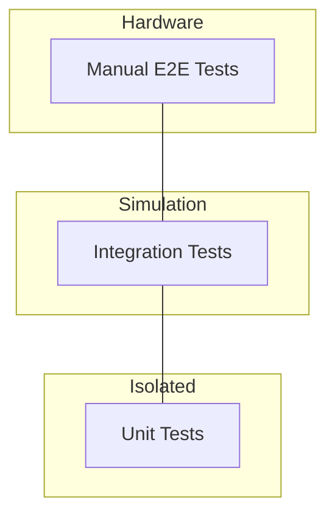

# Testing Strategy for Alpha HWR

## Overview

This document outlines the comprehensive testing strategy for the alpha-hwr library, designed to ensure reliability, maintainability, and serve as a reference for other language implementations.

## Testing Pyramid




## Test Categories

### 1. Unit Tests (Fast, Isolated)

**Purpose**: Test individual components in isolation without external dependencies.

**Location**: `tests/unit/`

**Characteristics**:
- No BLE/Bluetooth dependencies
- No asyncio event loops (unless testing async code in isolation)
- Fast execution (< 0.1s per test)
- High coverage of edge cases

**Examples**:
```python
# tests/unit/protocol/test_codec.py
def test_encode_float_be():
    """Test big-endian float encoding."""
    result = encode_float_be(1.5)
    assert result == bytes.fromhex("3FC00000")

def test_decode_float_be_inf():
    """Test handling of infinity values."""
    result = decode_float_be(bytes.fromhex("7F800000"))
    assert math.isinf(result)

# tests/unit/protocol/test_frame_builder.py
def test_build_class10_read():
    """Test building Class 10 READ frame."""
    frame = FrameBuilder.build_class10_read(0x5D012C)
    assert frame[0] == 0x27  # Start byte
    assert frame[4] == 0x0A  # Class 10
    # Verify CRC
    assert verify_crc(frame)
```

### 2. Integration Tests with Mock Pump

**Purpose**: Test full client workflows against a simulated pump without hardware.

**Location**: `tests/integration/`

**Characteristics**:
- Uses `MockPump` to simulate hardware
- Tests complete workflows (connect → authenticate → command → response)
- Tests error handling and edge cases
- Moderate execution time (0.5-2s per test)

**Examples**:
```python
# tests/integration/test_client_workflows.py
@pytest.mark.asyncio
async def test_read_telemetry_workflow():
    """Test complete telemetry reading workflow."""
    pump = MockPump()
    await pump.connect()
    await pump.authenticate()
    
    client = AlphaHWRClient(pump_address="MOCK")
    client.transport = MockTransport(pump)  # Inject mock
    
    await client.connect()
    telemetry = await client.telemetry.read_once()
    
    assert telemetry.voltage_ac_v > 0
    assert telemetry.speed_rpm >= 0

# tests/integration/test_control_operations.py
@pytest.mark.asyncio
async def test_start_stop_pump():
    """Test complete start/stop workflow."""
    pump = MockPump()
    client = create_mock_client(pump)
    
    await client.connect()
    
    # Start pump
    success = await client.control.start()
    assert success
    assert pump.state.running
    
    # Stop pump
    success = await client.control.stop()
    assert success
    assert not pump.state.running
```

### 3. End-to-End Tests with Real Hardware

**Purpose**: Validate actual hardware communication and catch real-world issues.

**Location**: `tests/e2e/` (optional, requires hardware)

**Characteristics**:
- Requires physical pump
- Requires BLE adapter
- Slow execution (5-30s per test)
- Run manually or in CI with hardware

**Examples**:
```python
# tests/e2e/test_real_pump.py
@pytest.mark.hardware
@pytest.mark.asyncio
async def test_real_pump_connection():
    """Test connecting to real pump."""
    # Only runs when --hardware flag passed
    address = os.getenv("PUMP_ADDRESS")
    if not address:
        pytest.skip("PUMP_ADDRESS not set")
    
    client = AlphaHWRClient(address)
    await client.connect()
    assert client.session.is_connected()
```

## Mock Pump Architecture

### Design Principles

1. **Stateful**: Maintains internal state (running, mode, setpoints)
2. **Protocol-Accurate**: Responds with correct GENI protocol frames
3. **Configurable**: Can be configured for different scenarios
4. **Observable**: Exposes state for test assertions

### Mock Pump Features

#### Core Features (Implemented)
- [x] Connection/disconnection simulation
- [x] Authentication handshake
- [x] Class 10 DataObject operations
- [x] Class 3 legacy register operations
- [x] Motor state telemetry
- [x] Flow/pressure telemetry
- [x] Temperature telemetry
- [x] Control commands (start/stop/mode)
- [x] Timestamp maps
- [x] Trend data

#### Enhanced Features (To Add)
- [ ] Schedule read/write operations
- [ ] Configuration backup/restore
- [ ] Clock sync operations
- [ ] Event log simulation
- [ ] Alarm/warning generation
- [ ] Realistic state transitions (startup delay, ramp-up)
- [ ] CRC validation (reject bad frames)
- [ ] Latency simulation
- [ ] Error injection modes

### Mock Pump Usage Patterns

#### Pattern 1: Direct Mock Pump
```python
pump = MockPump()
await pump.connect()
await pump.authenticate()

cmd = FrameBuilder.build_class10_read(0x570045)
response = await pump.send_command(cmd)
frame = FrameParser.parse_frame(response)
```

#### Pattern 2: Mock Transport Adapter
```python
class MockTransport:
    """Adapter that makes MockPump look like BLE transport."""
    def __init__(self, pump: MockPump):
        self.pump = pump
    
    async def write(self, data: bytes):
        response = await self.pump.send_command(data)
        self._on_notification(response)

client = AlphaHWRClient("MOCK")
client.transport = MockTransport(pump)
```

#### Pattern 3: BLE Mock (Full Bleak Simulation)
```python
class MockBleakClient:
    """Complete BLE stack simulation."""
    def __init__(self, address: str):
        self.pump = MockPump()
        self.address = address
    
    async def connect(self):
        await self.pump.connect()
    
    async def write_gatt_char(self, uuid, data):
        return await self.pump.send_command(data)
```

## Test Organization

### Directory Structure
```
tests/
├── unit/                          # Unit tests (fast, no I/O)
│   ├── protocol/
│   │   ├── test_codec.py
│   │   ├── test_frame_builder.py
│   │   ├── test_frame_parser.py
│   │   └── test_telemetry_decoder.py
│   ├── core/
│   │   ├── test_authentication.py
│   │   ├── test_session.py
│   │   └── test_transport.py
│   └── services/
│       ├── test_telemetry.py
│       ├── test_control.py
│       └── test_schedule.py
│
├── integration/                   # Integration tests (mock pump)
│   ├── test_client_workflows.py
│   ├── test_control_operations.py
│   ├── test_schedule_management.py
│   ├── test_configuration.py
│   └── test_error_handling.py
│
├── e2e/                          # End-to-end (real hardware)
│   ├── test_real_pump.py
│   └── README.md                # Instructions for hardware testing
│
├── mocks/
│   ├── mock_pump.py             # Mock pump implementation
│   ├── mock_transport.py        # Mock BLE transport
│   └── mock_bleak.py            # Mock Bleak client
│
└── fixtures/
    ├── conftest.py              # Pytest fixtures
    ├── sample_packets.py        # Real packet captures
    └── test_vectors.py          # Protocol test vectors
```

## Test Coverage Goals

### Coverage Targets
- **Overall**: 95%+
- **Core layer**: 100% (critical path)
- **Protocol layer**: 95%+ (packet formats)
- **Services layer**: 90%+ (business logic)
- **CLI layer**: 80%+ (user-facing)

### Critical Paths (Must be 100%)
- Authentication handshake
- CRC calculation/validation
- Frame parsing/building
- Core telemetry decoding
- Control mode setting
- Error handling

## Test Data & Fixtures

### Real Packet Captures
Store real packet captures for validation:

```python
# tests/fixtures/sample_packets.py
MOTOR_STATE_RESPONSE = bytes.fromhex(
    "2417f8e70a90004557..."
)

CONTROL_START_REQUEST = bytes.fromhex(
    "2710e7f80a9056000601..."
)

# Usage in tests
def test_parse_motor_state():
    frame = FrameParser.parse_frame(MOTOR_STATE_RESPONSE)
    assert frame.valid
    data = TelemetryDecoder.decode_motor_state(frame.payload)
    assert data["voltage_ac_v"] == 230.0
```

### Test Vectors for Cross-Language Validation

```python
# tests/fixtures/test_vectors.py
CODEC_TEST_VECTORS = [
    {
        "description": "Encode 1.5 as big-endian float",
        "function": "encode_float_be",
        "input": 1.5,
        "expected": "3FC00000",
    },
    {
        "description": "Decode temperature from telemetry",
        "function": "decode_float_be",
        "input": "42280000",
        "expected": 42.0,
    },
]

def test_codec_vectors():
    """Run all codec test vectors."""
    for vec in CODEC_TEST_VECTORS:
        if vec["function"] == "encode_float_be":
            result = encode_float_be(vec["input"])
            assert result.hex().upper() == vec["expected"]
```

## Pytest Configuration

```python
# conftest.py
import pytest
import asyncio

@pytest.fixture
def mock_pump():
    """Create a fresh mock pump for each test."""
    pump = MockPump()
    yield pump
    # Cleanup if needed

@pytest.fixture
async def connected_pump():
    """Create and connect a mock pump."""
    pump = MockPump()
    await pump.connect()
    await pump.authenticate()
    yield pump
    await pump.disconnect()

@pytest.fixture
async def mock_client(mock_pump):
    """Create client with mock transport."""
    client = AlphaHWRClient("MOCK")
    client.transport = MockTransport(mock_pump)
    await client.connect()
    yield client
    await client.disconnect()

# Custom markers
def pytest_configure(config):
    config.addinivalue_line("markers", "hardware: tests requiring real pump")
    config.addinivalue_line("markers", "slow: tests that take >1s")
    config.addinivalue_line("markers", "integration: integration tests")
```

## Running Tests

### Run all tests
```bash
pytest tests/
```

### Run only unit tests (fast)
```bash
pytest tests/unit/ -v
```

### Run integration tests
```bash
pytest tests/integration/ -v
```

### Run with coverage
```bash
pytest --cov=src/alpha_hwr --cov-report=html
```

### Run hardware tests (requires pump)
```bash
PUMP_ADDRESS=XX:XX:XX:XX:XX:XX pytest tests/e2e/ -m hardware
```

### Run tests in parallel
```bash
pytest -n auto  # Uses pytest-xdist
```

## Continuous Integration

### GitHub Actions Workflow

```yaml
name: Tests

on: [push, pull_request]

jobs:
  test:
    runs-on: ${{ matrix.os }}
    strategy:
      matrix:
        os: [ubuntu-latest, macos-latest, windows-latest]
        python-version: [3.13, 3.14]
    
    steps:
      - uses: actions/checkout@v3
      
      - name: Set up Python
        uses: actions/setup-python@v4
        with:
          python-version: ${{ matrix.python-version }}
      
      - name: Install dependencies
        run: |
          pip install -e ".[dev]"
      
      - name: Run unit tests
        run: pytest tests/unit/ -v
      
      - name: Run integration tests
        run: pytest tests/integration/ -v
      
      - name: Coverage report
        run: pytest --cov=src/alpha_hwr --cov-report=xml
      
      - name: Upload coverage
        uses: codecov/codecov-action@v3
```

## Performance Benchmarks

### Benchmark Goals
- Protocol encoding/decoding: < 1ms per operation
- Mock pump response: < 5ms per command
- Full telemetry cycle: < 100ms

### Benchmark Tests
```python
# tests/benchmarks/test_performance.py
import pytest
import time

def test_encode_float_performance():
    """Benchmark float encoding."""
    iterations = 10000
    start = time.perf_counter()
    
    for i in range(iterations):
        encode_float_be(1.5)
    
    elapsed = time.perf_counter() - start
    per_op = (elapsed / iterations) * 1000  # ms
    
    assert per_op < 0.01, f"Encoding too slow: {per_op:.3f}ms"

@pytest.mark.asyncio
async def test_mock_pump_latency():
    """Benchmark mock pump response time."""
    pump = MockPump()
    await pump.connect()
    await pump.authenticate()
    
    cmd = FrameBuilder.build_class10_read(0x570045)
    
    start = time.perf_counter()
    response = await pump.send_command(cmd)
    elapsed = (time.perf_counter() - start) * 1000  # ms
    
    assert elapsed < 5.0, f"Mock pump too slow: {elapsed:.1f}ms"
```

## Test Documentation Standards

Every test should follow this pattern:

```python
@pytest.mark.asyncio  # If async
async def test_specific_behavior():
    """Test that specific behavior works correctly.
    
    This test verifies:
    1. What it sets up
    2. What action it performs
    3. What result it expects
    
    Related to: [Issue #123, Protocol spec section 4.2]
    """
    # Arrange: Set up test conditions
    pump = MockPump()
    await pump.connect()
    
    # Act: Perform the action
    result = await pump.authenticate()
    
    # Assert: Verify the outcome
    assert result is True
    assert pump.state.authenticated
```

## Cross-Language Test Portability

### Test Vector Format
To enable testing in other languages, provide test vectors in JSON:

```json
{
  "protocol_tests": {
    "codec": [
      {
        "name": "encode_float_be_positive",
        "function": "encode_float_be",
        "input": 1.5,
        "expected_hex": "3FC00000"
      },
      {
        "name": "decode_motor_voltage",
        "function": "decode_float_be",
        "input_hex": "43660000",
        "expected": 230.0
      }
    ],
    "frames": [
      {
        "name": "parse_class10_motor_state",
        "input_hex": "2417f8e70a90004557...",
        "expected": {
          "valid": true,
          "class": 10,
          "sub_id": 69,
          "obj_id": 87
        }
      }
    ]
  }
}
```

## Known Test Issues

### Slow Tests
Some tests involving schedule operations are very slow. Investigation needed:
- `test_schedule_write.py` - Takes 30+ seconds per test
- Root cause: Unknown (needs profiling)
- Workaround: Mark with `@pytest.mark.slow` and skip in CI

### Flaky Tests
None currently identified.

## Future Enhancements

- [ ] Property-based testing with Hypothesis
- [ ] Mutation testing with `mutmut`
- [ ] Stress testing (rapid connect/disconnect)
- [ ] Fuzzing protocol parsers
- [ ] Memory profiling
- [ ] Test coverage visualization
- [ ] Automated hardware test scheduling

---

**Last Updated**: 2026-01-31
**Status**: Living document - update as testing evolves
