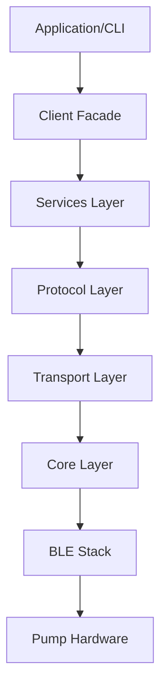
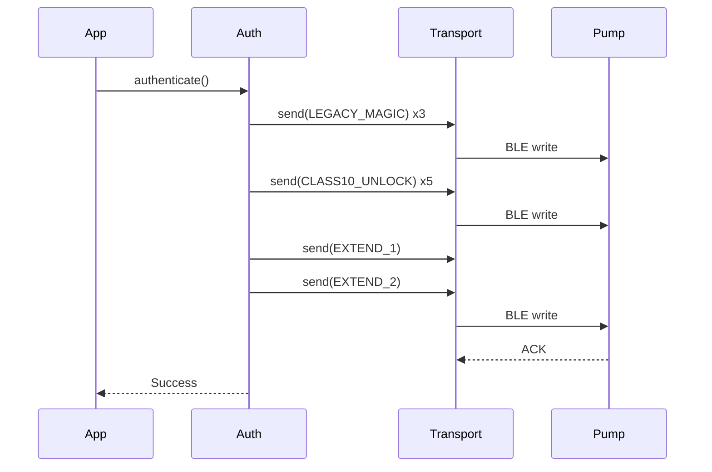
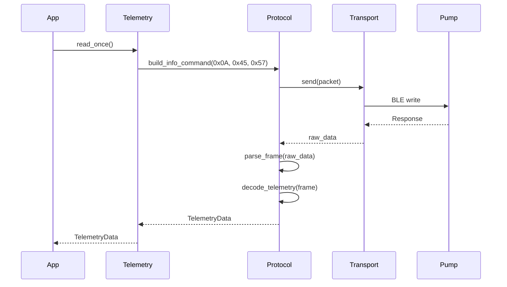
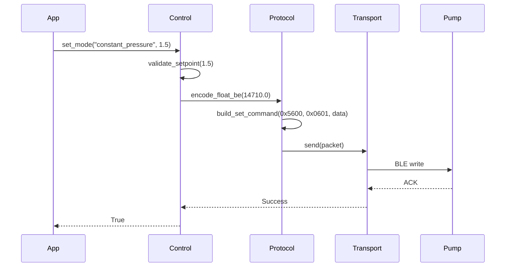
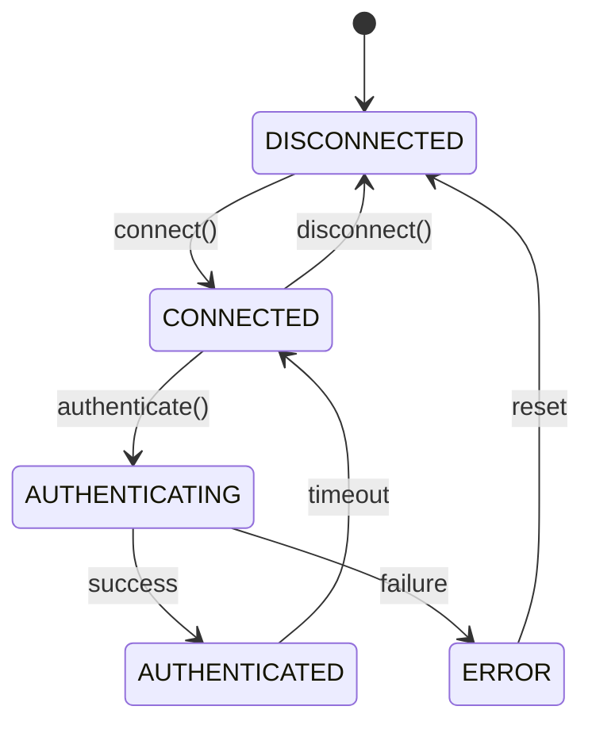

# Protocol Architecture

This document visualizes the ALPHA HWR protocol architecture and data flows.

For detailed BLE layer information, see [BLE Architecture](ble_architecture.md).

## 1. System Overview

The system follows a layered architecture pattern, separating concerns from low-level transport to high-level business logic.

## 2. Authentication Sequence

The authentication process is a strict sequence of "magic packets" required to unlock the pump's capabilities.

## 3. Telemetry Reading Flow

Telemetry data flows from the pump's notification characteristic, through the transport layer, parsed by the protocol layer, and consumed by the telemetry service.

## 4. Control Mode Setting Flow

Setting a control mode (e.g., Constant Pressure) involves converting units, encoding the command, and ensuring reliable delivery via transaction locking.

## 5. Session State Machine

The connection session is managed by a state machine to ensure operations are only performed when the connection is in the correct state.

## 6. Layer Responsibilities

| Layer | Responsibility | Key Components |
| :--- | :--- | :--- |
| **Application** | User Interface | CLI, Scripts |
| **Client** | Unified API | `AlphaHWRClient` |
| **Services** | Business Logic | `TelemetryService`, `ControlService` |
| **Protocol** | Encoding/Decoding | `FrameBuilder`, `FrameParser`, `Codec` |
| **Transport** | BLE Communication | `Transport`, `Bleak` |
| **Core** | Session/Auth | `Session`, `Authentication` |
