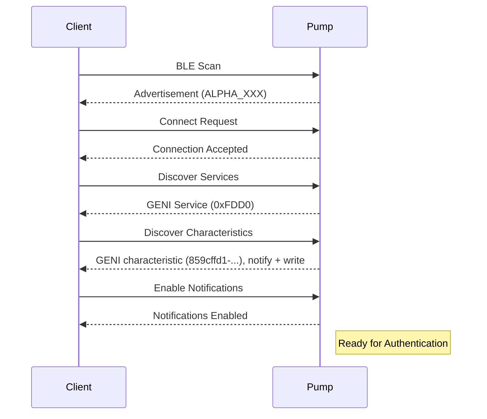

# Packet Trace: BLE Connection Setup

This document shows the complete BLE connection sequence for the ALPHA HWR pump, from discovery to being ready for authentication.

## Overview

Before authenticating, you must:
1. Discover the pump via BLE scanning
2. Connect to the pump
3. Discover GATT services and characteristics
4. Enable notifications

## Connection Flow




---

## Step 1: BLE Discovery

### 1.1 Scan for Devices

The pump advertises with a recognizable name pattern.

**Advertisement Name**: `ALPHA_<serial>` or `ALPHA <serial>`

**Examples**:
- `ALPHA_123456`
- `ALPHA 123456`
- `ALPHA_XXXXXXXXXXXX`

**Service UUID** (advertised): `0000fdd0-0000-1000-8000-00805f9b34fb`

### 1.2 Implementation

```python
import asyncio
from bleak import BleakScanner


async def discover_alpha_pumps(timeout=10.0):
    """
    Scan for ALPHA HWR pumps.

    Returns list of discovered devices.
    """
    print(f"Scanning for ALPHA pumps (timeout: {timeout}s)...")

    devices = await BleakScanner.discover(timeout=timeout)

    alpha_pumps = []
    for device in devices:
        if device.name and "ALPHA" in device.name:
            alpha_pumps.append(device)
            print(f"Found: {device.name} ({device.address})")

    return alpha_pumps


# Usage
pumps = await discover_alpha_pumps()
if not pumps:
    print("No pumps found!")
else:
    print(f"Found {len(pumps)} pump(s)")
```

### 1.3 JavaScript Example

```javascript
// Web Bluetooth API
async function discoverPump() {
  try {
    const device = await navigator.bluetooth.requestDevice({
      filters: [
        { namePrefix: "ALPHA" },
        { services: ["0000fdd0-0000-1000-8000-00805f9b34fb"] }
      ]
    });
    
    console.log(`Connected to: ${device.name}`);
    return device;
  } catch (error) {
    console.error("Discovery failed:", error);
  }
}
```

**Test Milestone**:
- [x] Can discover pump by name
- [x] Pump appears in scan results
- [x] Device address is valid

---

## Step 2: BLE Connection

### 2.1 Connect to Device

Once discovered, connect to the pump using its BLE address.

**Implementation**:
```python
from bleak import BleakClient


async def connect_to_pump(address):
    """
    Connect to pump via BLE.

    Args:
        address: BLE MAC address (e.g., "XX:XX:XX:XX:XX:XX")

    Returns:
        BleakClient instance
    """
    print(f"Connecting to {address}...")

    client = BleakClient(address, timeout=15.0)
    await client.connect()

    if client.is_connected:
        print("Connected successfully!")
    else:
        raise Exception("Connection failed")

    return client
```

### 2.2 Bonding

**The pump drops an unbonded connection after about 1.8 seconds** — reliably,
to within a few tens of milliseconds, and whether or not you are sending
anything. This is not a client bug, a keepalive problem or a pacing problem,
and no amount of traffic prevents it.

Pair/bond with the device once at the OS level and the connection stays up.
On Linux this is `bluetoothctl pair`; on macOS it happens through the system
Bluetooth pane. If your session dies at the same moment every time, this is
the cause.

**Test Milestone**:
- [x] Successfully connects to pump
- [x] Device is bonded
- [x] Connection survives past ~2 s of idle

---

## Step 3: Service Discovery

### 3.1 GENI Service UUIDs

The pump exposes one GATT service with **one** characteristic, used for both
directions.

**GENI Service**:
- **UUID**: `0000fdd0-0000-1000-8000-00805f9b34fb`

**GENI Characteristic**:
- **UUID**: `859cffd1-036e-432a-aa28-1a0085b87ba9`
- **Properties**: Write Without Response, Notify

> Earlier revisions of this document described two characteristics —
> `0000fdd1` for writes and `0000fdd2` for notifications. Neither exists.
> An implementation that requires them fails at service discovery, before it
> ever sends a frame.

### 3.2 Discover Services

```python
GENI_SERVICE_UUID = "0000fdd0-0000-1000-8000-00805f9b34fb"
GENI_CHAR_UUID = "859cffd1-036e-432a-aa28-1a0085b87ba9"


async def discover_geni_service(client):
    """
    Discover the GENI service and its characteristic.

    Args:
        client: Connected BleakClient

    Returns:
        (service, char)
    """
    print("Discovering services...")

    service = None
    for svc in client.services:
        if svc.uuid.lower() == GENI_SERVICE_UUID.lower():
            service = svc
            break

    if not service:
        raise Exception("GENI service not found")

    print(f"Found GENI service: {service.uuid}")

    char = None
    for c in service.characteristics:
        if c.uuid.lower() == GENI_CHAR_UUID.lower():
            char = c
            print(f"  GENI Char: {c.uuid} (properties: {c.properties})")

    if not char:
        raise Exception("GENI characteristic not found")

    return (service, char)
```

**Test Milestone**:
- [x] GENI service discovered
- [x] GENI characteristic found
- [x] Correct UUIDs matched

---

## Step 4: Enable Notifications

### 4.1 Subscribe on the GENI Characteristic

The pump sends responses and telemetry via notifications on the same
characteristic you write to.

**Implementation**:
```python
async def enable_notifications(client):
    """Enable notifications for responses from the pump."""

    def notification_handler(sender, data):
        print(f"<< Received ({len(data)} bytes): {data.hex(' ')}")
        response_queue.append(bytes(data))

    await client.start_notify(GENI_CHAR_UUID, notification_handler)
    print("Notifications enabled")


# Global response queue
response_queue = []
```

### 4.2 Verify Notifications

After enabling, the pump may send an initial notification (sometimes empty or telemetry).

**Expected Behavior**:
- No error when enabling notifications
- Handler is called when pump sends data
- Data arrives as `bytearray` or `bytes`

**Test Milestone**:
- [x] Notifications enabled without error
- [x] Handler registered successfully
- [x] Ready to receive responses

---

## Step 5: Complete Setup Example

### 5.1 Full Connection Flow

```python
import asyncio
from bleak import BleakClient, BleakScanner

# UUIDs
GENI_SERVICE_UUID = "0000fdd0-0000-1000-8000-00805f9b34fb"
GENI_CHAR_UUID = "859cffd1-036e-432a-aa28-1a0085b87ba9"

# Response queue
response_queue = []


def notification_handler(sender, data):
    """Handle notifications from pump."""
    print(f"<< Notification ({len(data)} bytes): {data.hex(' ')}")
    response_queue.append(bytes(data))


async def setup_connection(address=None):
    """
    Complete BLE connection setup.

    Args:
        address: BLE address (if None, will scan)

    Returns:
        (client, char_uuid)
    """
    # Step 1: Discover pump if no address provided
    if address is None:
        print("Scanning for ALPHA pumps...")
        devices = await BleakScanner.discover(timeout=10.0)

        for device in devices:
            if device.name and "ALPHA" in device.name:
                address = device.address
                print(f"Found pump: {device.name} at {address}")
                break

        if not address:
            raise Exception("No ALPHA pump found")

    # Step 2: Connect to pump
    print(f"\nConnecting to {address}...")
    client = BleakClient(address, timeout=15.0)
    await client.connect()
    print("Connected!")

    # Step 3: Verify services
    print("\nDiscovering services...")
    services = client.services
    geni_service = None

    for service in services:
        if service.uuid.lower() == GENI_SERVICE_UUID.lower():
            geni_service = service
            print(f"Found GENI service: {service.uuid}")
            break

    if not geni_service:
        await client.disconnect()
        raise Exception("GENI service not found")

    # Step 4: Verify the characteristic
    print("\nVerifying characteristic...")
    found = False

    for char in geni_service.characteristics:
        if char.uuid.lower() == GENI_CHAR_UUID.lower():
            found = True
            print(f"  GENI: {char.uuid} ({char.properties})")

    if not found:
        await client.disconnect()
        raise Exception("GENI characteristic not found")

    # Step 5: Enable notifications
    print("\nEnabling notifications...")
    await client.start_notify(GENI_CHAR_UUID, notification_handler)
    print("Notifications enabled!")

    print("\n✓ Connection setup complete!")
    print("  Ready for authentication\n")

    return (client, GENI_CHAR_UUID)


async def main():
    """Test connection setup."""
    try:
        client, char_uuid = await setup_connection()

        # Keep connection alive
        print("Connection active. Press Ctrl+C to disconnect...")
        await asyncio.sleep(30)

        # Cleanup
        await client.disconnect()
        print("Disconnected")

    except Exception as e:
        print(f"Error: {e}")


if __name__ == "__main__":
    asyncio.run(main())
```

### 5.2 Expected Output

```
Scanning for ALPHA pumps...
Found pump: ALPHA_123456 at XX:XX:XX:XX:XX:XX

Connecting to XX:XX:XX:XX:XX:XX...
Connected!

Discovering services...
Found GENI service: 0000fdd0-0000-1000-8000-00805f9b34fb

Verifying characteristic...
  GENI: 859cffd1-036e-432a-aa28-1a0085b87ba9 (['write-without-response', 'notify'])

Enabling notifications...
Notifications enabled!

✓ Connection setup complete!
  Ready for authentication

Connection active. Press Ctrl+C to disconnect...
```

**Test Milestone**:
- [x] Full connection flow completes
- [x] All services and characteristics found
- [x] Notifications enabled
- [x] Ready for authentication

---

## Common Issues

### Issue 1: Pump Not Found in Scan

**Symptom**: No devices with "ALPHA" in name.

**Causes**:
- Pump is off or out of range
- Pump is already connected to another device
- Bluetooth adapter disabled

**Fix**:
1. Verify pump is powered on
2. Disconnect pump from other devices (phone app)
3. Move closer to pump
4. Restart Bluetooth adapter

---

### Issue 2: Connection Timeout

**Symptom**: Connection attempt times out.

**Causes**:
- Pump went to sleep
- Pump is paired with another device
- BLE interference

**Fix**:
1. Wake pump (touch button)
2. Unpair from other devices
3. Increase connection timeout (15-20 seconds)
4. Retry connection

---

### Issue 3: Service Not Found

**Symptom**: GENI service UUID not discovered.

**Causes**:
- Connected to wrong device
- BLE cache issue
- Incompatible firmware

**Fix**:
1. Verify device name contains "ALPHA"
2. Clear BLE cache (restart app/OS)
3. Check pump firmware version
4. Use correct service UUID

---

### Issue 4: Notifications Not Working

**Symptom**: Notifications never trigger handler.

**Causes**:
- Wrong characteristic UUID
- Handler not registered
- Pump not sending data yet

**Fix**:
1. Verify the GENI characteristic UUID is correct
2. Ensure notifications enabled before sending commands
3. Check bonding — an unbonded link is dropped at about 1.8 s
4. Check handler is `async` if required by library

---

## Platform-Specific Notes

### Python (Bleak)

```python
# Bleak is cross-platform and works on Windows, macOS, Linux
from bleak import BleakClient, BleakScanner

# No special setup needed
```

### JavaScript (Web Bluetooth)

```javascript
// Only works in browsers with Web Bluetooth
// Requires HTTPS or localhost
const device = await navigator.bluetooth.requestDevice({
  filters: [{ namePrefix: "ALPHA" }]
});

const server = await device.gatt.connect();
const service = await server.getPrimaryService("0000fdd0-0000-1000-8000-00805f9b34fb");
```

### Rust (btleplug)

```rust
use btleplug::api::{Central, Manager as _, Peripheral as _};
use btleplug::platform::{Adapter, Manager};

let manager = Manager::new().await?;
let adapters = manager.adapters().await?;
let central = &adapters[0];

// Scan and connect
```

### C/C++ (Platform-specific)

**Windows**: Use Windows BLE APIs
**macOS/iOS**: Use CoreBluetooth
**Linux**: Use BlueZ D-Bus API

---

## Next Steps

After successful connection setup:

1. **Authenticate**: Send authentication sequence (see [02_authentication.md](02_authentication.md))
2. **Read Telemetry**: Request telemetry data (see [03_telemetry_stream.md](03_telemetry_stream.md))
3. **Control Pump**: Send control commands (see [04_set_mode.md](04_set_mode.md))

---

## Reference

- [BLE Architecture](../ble_architecture.md) - BLE layer details
- [Connection Protocol](../connection.md) - Protocol overview
- [Authentication](02_authentication.md) - Next step after connection

---

## Testing Checklist

Use this checklist to verify your connection implementation:

- [ ] Discovers pump via BLE scan
- [ ] Connects successfully
- [ ] Finds GENI service (0xFDD0)
- [ ] Finds the GENI characteristic (859cffd1-036e-432a-aa28-1a0085b87ba9)
- [ ] Enables notifications successfully
- [ ] Notification handler receives data
- [ ] Connection remains stable for 30+ seconds
- [ ] Clean disconnection works
- [ ] Can reconnect after disconnection

Once all items are checked, proceed to authentication!
