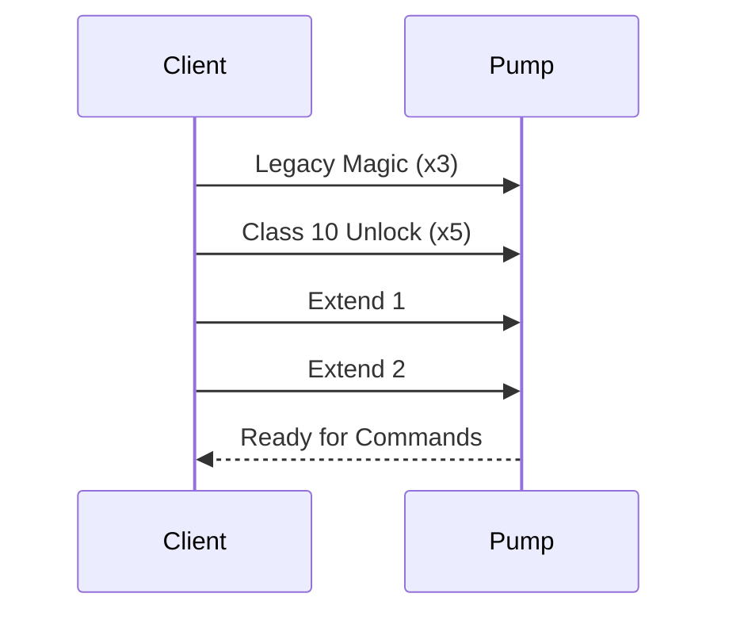

# Packet Trace: Authentication Sequence

This document shows a complete authentication sequence with byte-by-byte annotations.

## Overview

After BLE connection, the pump requires a specific sequence of "magic packets" to unlock full functionality. This sequence must be sent **exactly** as specified.

## Authentication Flow




## Packet 1-3: Legacy Magic (Send 3 Times)

### Hex Dump
```
27 07 E7 F8 02 03 94 95 96 EB 47
```

### Byte-by-Byte Breakdown

| Offset | Byte | Name | Description |
|--------|------|------|-------------|
| 0 | `0x27` | Start Byte | Request frame marker |
| 1 | `0x07` | Length | Total length = 7 bytes (up to last APDU byte) |
| 2 | `0xE7` | Service ID | GENI service |
| 3 | `0xF8` | Source | Client address |
| 4 | `0x02` | Class | Class 2 (Register-based operations) |
| 5 | `0x03` | OpSpec | SET operation, 3 data bytes |
| 6 | `0x94` | Register High | Register address 0x9495 high byte |
| 7 | `0x95` | Register Low | Register address 0x9495 low byte |
| 8 | `0x96` | Data | Unlock value |
| 9 | `0xEB` | CRC High | CRC-16-CCITT high byte |
| 10 | `0x47` | CRC Low | CRC-16-CCITT low byte |

### Purpose
Unlocks legacy Class 2/3 commands (register-based operations).

### Repetition
Must be sent **exactly 3 times** in sequence.

### Expected Response
None (pump acknowledges silently).

### Implementation
```python
LEGACY_MAGIC = bytes.fromhex("2707e7f80203949596eb47")

for _ in range(3):
    await tx_char.write_value(LEGACY_MAGIC)
    await asyncio.sleep(0.05)  # Small delay between packets
```

---

## Packet 4-8: Class 10 Unlock (Send 5 Times)

### Hex Dump
```
27 07 E7 F8 0A 03 56 00 06 C5 5A
```

### Byte-by-Byte Breakdown

| Offset | Byte | Name | Description |
|--------|------|------|-------------|
| 0 | `0x27` | Start Byte | Request frame |
| 1 | `0x07` | Length | 7 bytes |
| 2 | `0xE7` | Service ID | GENI service |
| 3 | `0xF8` | Source | Client |
| 4 | `0x0A` | Class | Class 10 (DataObject) |
| 5 | `0x03` | OpSpec | SET operation, 3 bytes follow |
| 6 | `0x56` | Sub ID High | Sub 0x5600 (control/unlock subsystem) |
| 7 | `0x00` | Sub ID Low | Sub 0x5600 low byte |
| 8 | `0x06` | Object ID | Object 0x0006 (unlock object) |
| 9 | `0xC5` | CRC High | CRC-16-CCITT high byte |
| 10 | `0x5A` | CRC Low | CRC-16-CCITT low byte |

### Purpose
Unlocks Class 10 commands (modern DataObject operations). Required for telemetry, control, and all advanced features.

### Repetition
Must be sent **exactly 5 times** in sequence.

### Expected Response
None (pump acknowledges silently).

### Implementation
```python
CLASS10_UNLOCK = bytes.fromhex("2707e7f80a03560006c55a")

for _ in range(5):
    await tx_char.write_value(CLASS10_UNLOCK)
    await asyncio.sleep(0.05)
```

---

## Packet 9: Extend 1

### Hex Dump
```
27 05 E7 F8 05 C1 4B C3 82
```

### Byte-by-Byte Breakdown

| Offset | Byte | Name | Description |
|--------|------|------|-------------|
| 0 | `0x27` | Start Byte | Request frame |
| 1 | `0x05` | Length | 5 bytes |
| 2 | `0xE7` | Service ID | GENI service |
| 3 | `0xF8` | Source | Client |
| 4 | `0x05` | Class | Class 5 (Extension protocol) |
| 5 | `0xC1` | OpSpec | Extension command 1 |
| 6 | `0x4B` | Data | Extension parameter |
| 7 | `0xC3` | CRC High | CRC-16-CCITT high byte |
| 8 | `0x82` | CRC Low | CRC-16-CCITT low byte |

### Purpose
First extension packet. Sent before Extend 2 (order documented in connection.md Step C, observed from Grundfos app).

### Repetition
Send **exactly once**.

### Expected Response
None.

### Implementation
```python
EXTEND_1 = bytes.fromhex("2705e7f805c14bc382")

await tx_char.write_value(EXTEND_1)
await asyncio.sleep(0.05)
```

---

## Packet 10: Extend 2

### Hex Dump
```
27 05 E7 F8 0B C1 0F D0 C3
```

### Byte-by-Byte Breakdown

| Offset | Byte | Name | Description |
|--------|------|------|-------------|
| 0 | `0x27` | Start Byte | Request frame |
| 1 | `0x05` | Length | 5 bytes |
| 2 | `0xE7` | Service ID | GENI service |
| 3 | `0xF8` | Source | Client |
| 4 | `0x0B` | Class | Class 11 (Session extension) |
| 5 | `0xC1` | OpSpec | Extension command 2 |
| 6 | `0x0F` | Data | Extension parameter |
| 7 | `0xD0` | CRC High | CRC-16-CCITT high byte |
| 8 | `0xC3` | CRC Low | CRC-16-CCITT low byte |

### Purpose
Second extension packet. Enables full access to all pump features.

### Repetition
Send **exactly once**.

### Expected Response
None.

### Implementation
```python
EXTEND_2 = bytes.fromhex("2705e7f80bc10fd0c3")

await tx_char.write_value(EXTEND_2)
await asyncio.sleep(0.1)
```

---

## Complete Implementation

### Python Example

```python
import asyncio
from bleak import BleakClient

# Authentication packets (pre-calculated with CRC)
LEGACY_MAGIC = bytes.fromhex("2707e7f80203949596eb47")
CLASS10_UNLOCK = bytes.fromhex("2707e7f80a03560006c55a")
EXTEND_1 = bytes.fromhex("2705e7f805c14bc382")
EXTEND_2 = bytes.fromhex("2705e7f80bc10fd0c3")

# BLE UUIDs
GENI_SERVICE_UUID = "0000fdd0-0000-1000-8000-00805f9b34fb"
TX_CHAR_UUID = "0000fdd1-0000-1000-8000-00805f9b34fb"
RX_CHAR_UUID = "0000fdd2-0000-1000-8000-00805f9b34fb"


async def authenticate(client: BleakClient):
    """Perform full authentication sequence."""

    # Get TX characteristic
    tx_char = client.services.get_characteristic(TX_CHAR_UUID)

    # Step 1: Legacy Magic (3x)
    print("Sending Legacy Magic packets...")
    for i in range(3):
        await tx_char.write_value(LEGACY_MAGIC)
        print(f"  Sent {i + 1}/3: {LEGACY_MAGIC.hex(' ')}")
        await asyncio.sleep(0.05)

    # Step 2: Class 10 Unlock (5x)
    print("Sending Class 10 Unlock packets...")
    for i in range(5):
        await tx_char.write_value(CLASS10_UNLOCK)
        print(f"  Sent {i + 1}/5: {CLASS10_UNLOCK.hex(' ')}")
        await asyncio.sleep(0.05)

    # Step 3: Extend 1 (1x)
    print("Sending Extend 1...")
    await tx_char.write_value(EXTEND_1)
    print(f"  Sent: {EXTEND_1.hex(' ')}")
    await asyncio.sleep(0.05)

    # Step 4: Extend 2 (1x)
    print("Sending Extend 2...")
    await tx_char.write_value(EXTEND_2)
    print(f"  Sent: {EXTEND_2.hex(' ')}")
    await asyncio.sleep(0.1)

    print("Authentication complete!")


async def main():
    # Connect to pump
    address = "XX:XX:XX:XX:XX:XX"  # Replace with pump address

    async with BleakClient(address) as client:
        print(f"Connected to {address}")

        # Perform authentication
        await authenticate(client)

        # Now ready for commands
        print("Pump is now authenticated and ready for commands")


if __name__ == "__main__":
    asyncio.run(main())
```

### JavaScript Example

```javascript
// Authentication packets
const LEGACY_MAGIC = new Uint8Array([0x27, 0x07, 0xE7, 0xF8, 0x02, 0x03, 0x94, 0x95, 0x96, 0xEB, 0x47]);
const CLASS10_UNLOCK = new Uint8Array([0x27, 0x07, 0xE7, 0xF8, 0x0A, 0x03, 0x56, 0x00, 0x06, 0xC5, 0x5A]);
const EXTEND_1 = new Uint8Array([0x27, 0x05, 0xE7, 0xF8, 0x05, 0xC1, 0x4B, 0xC3, 0x82]);
const EXTEND_2 = new Uint8Array([0x27, 0x05, 0xE7, 0xF8, 0x0B, 0xC1, 0x0F, 0xD0, 0xC3]);

async function authenticate(txCharacteristic) {
  // Step 1: Legacy Magic (3x)
  for (let i = 0; i < 3; i++) {
    await txCharacteristic.writeValue(LEGACY_MAGIC);
    await sleep(50);
  }
  
  // Step 2: Class 10 Unlock (5x)
  for (let i = 0; i < 5; i++) {
    await txCharacteristic.writeValue(CLASS10_UNLOCK);
    await sleep(50);
  }
  
  // Step 3: Extend 1
  await txCharacteristic.writeValue(EXTEND_1);
  await sleep(50);
  
  // Step 4: Extend 2
  await txCharacteristic.writeValue(EXTEND_2);
  await sleep(100);
  
  console.log("Authentication complete");
}

function sleep(ms) {
  return new Promise(resolve => setTimeout(resolve, ms));
}
```

---

## Timing Considerations

### Recommended Delays
- **Between packets:** 50ms minimum
- **After Extend 2:** 100ms minimum
- **Before first command:** 200ms recommended

### Rationale
- Pump needs time to process each packet
- Too fast: Packets may be dropped
- Too slow: No problem, but slower authentication

### Total Time
Typical authentication takes **~1 second** total.

---

## Validation

### How to Verify Authentication Worked

**Test 1: Send telemetry request**
```python
# After authentication, this should work:
info_cmd = build_info_command(class_byte=0x0A, sub_id=0x0045, obj_id=0x0057)
await tx_char.write_value(info_cmd)

# Should receive telemetry response
```

**Test 2: Check for error responses**
```
If authentication failed:
- Commands will timeout (no response)
- OR pump sends NACK/error response
```

**Test 3: Try control command**
```python
# Should be able to set mode after authentication
set_cmd = build_set_command(sub=0x5600, obj=0x0601, value=...)
await tx_char.write_value(set_cmd)
# Should receive ACK
```

---

## Common Issues

### Issue 1: Wrong Packet Count
**Symptom:** Commands don't work after authentication.
**Cause:** Sent wrong number of Legacy Magic or Class 10 Unlock packets.
**Fix:** Must be exactly 3 and 5 respectively.

### Issue 2: Wrong Packet Order
**Symptom:** Authentication fails silently.
**Cause:** Sent packets out of order.
**Fix:** Follow exact sequence: Legacy (3x) → Class10 (5x) → Extend1 → Extend2

### Issue 3: CRC Error
**Symptom:** Pump rejects authentication packets.
**Cause:** Typo in packet bytes.
**Fix:** Use exact bytes from this document, don't recalculate.

### Issue 4: Packets Too Fast
**Symptom:** Some authentication packets dropped.
**Cause:** No delay between packets.
**Fix:** Add 50ms delay between each packet.

---

## Security Note

This authentication sequence uses **security through obscurity**:
- No cryptographic challenge-response
- No shared secrets
- Packets are fixed (anyone can replay them)

**Recommendation:**
- Use BLE pairing for true security
- Don't rely on this for access control
- Assume anyone with BLE access can control pump

---

## Reference

See Python implementation:
- `src/alpha_hwr/core/authentication.py` - Complete implementation with detailed comments
- `tests/core/test_authentication.py` - Test suite

## Related Documents

- [01_connection.md](01_connection.md) - BLE connection setup
- [03_telemetry_stream.md](03_telemetry_stream.md) - Reading telemetry after authentication
- [04_set_mode.md](04_set_mode.md) - Control commands after authentication
