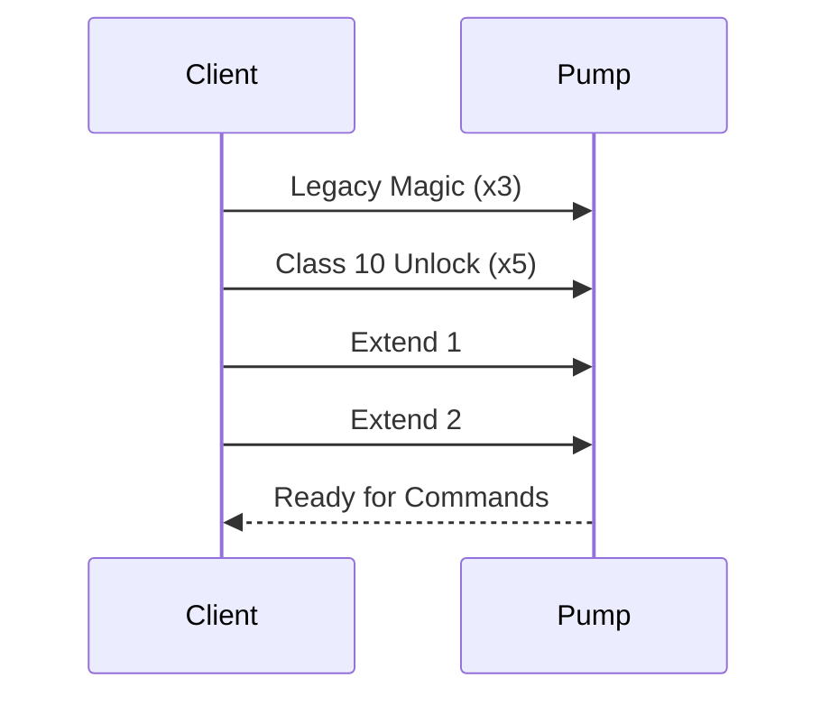

# Packet Trace: Authentication Sequence

This document shows a complete authentication sequence with byte-by-byte annotations.

## Overview

After BLE connection, the pump requires a specific sequence of "magic packets" to unlock full functionality. This sequence must be sent **exactly** as specified.

## Authentication Flow




## Packet 1-3: Legacy Magic (Send 3 Times)

### Hex Dump
```
27 06 E7 F8 00 67 A3 E3
```

### Byte-by-Byte Breakdown

| Offset | Byte | Name | Description |
|--------|------|------|-------------|
| 0 | `0x27` | Start Byte | Request frame marker |
| 1 | `0x06` | Length | Total length = 6 bytes (up to last APDU byte) |
| 2 | `0xE7` | Service ID | GENI service |
| 3 | `0xF8` | Source | Client address |
| 4 | `0x00` | Class/Op | Legacy authentication command |
| 5 | `0x67` | Data | Magic value |
| 6 | `0xA3` | CRC High | CRC-16/MODBUS high byte |
| 7 | `0xE3` | CRC Low | CRC-16/MODBUS low byte |

### Purpose
Unlocks legacy Class 2/3 commands (register-based operations).

### Repetition
Must be sent **exactly 3 times** in sequence.

### Expected Response
None (pump acknowledges silently).

### Implementation
```python
LEGACY_MAGIC = bytes([0x27, 0x06, 0xE7, 0xF8, 0x00, 0x67, 0xA3, 0xE3])

for _ in range(3):
    await tx_char.write_value(LEGACY_MAGIC)
    await asyncio.sleep(0.05)  # Small delay between packets
```

---

## Packet 4-8: Class 10 Unlock (Send 5 Times)

### Hex Dump
```
27 07 E7 F8 0A 04 00 85 02 12
```

### Byte-by-Byte Breakdown

| Offset | Byte | Name | Description |
|--------|------|------|-------------|
| 0 | `0x27` | Start Byte | Request frame |
| 1 | `0x07` | Length | 7 bytes |
| 2 | `0xE7` | Service ID | GENI service |
| 3 | `0xF8` | Source | Client |
| 4 | `0x0A` | Class | Class 10 (DataObject) |
| 5 | `0x04` | Op-Spec | Unlock operation |
| 6 | `0x00` | Sub ID High | Sub 0x0000 |
| 7 | `0x85` | Data | Unlock code |
| 8 | `0x02` | CRC High | CRC high byte |
| 9 | `0x12` | CRC Low | CRC low byte |

### Purpose
Unlocks Class 10 commands (modern DataObject operations). Required for telemetry, control, and all advanced features.

### Repetition
Must be sent **exactly 5 times** in sequence.

### Expected Response
None (pump acknowledges silently).

### Implementation
```python
CLASS10_UNLOCK = bytes([0x27, 0x07, 0xE7, 0xF8, 0x0A, 0x04, 0x00, 0x85, 0x02, 0x12])

for _ in range(5):
    await tx_char.write_value(CLASS10_UNLOCK)
    await asyncio.sleep(0.05)
```

---

## Packet 9: Extend 1

### Hex Dump
```
27 07 E7 F8 1A 2C 00 52 01 02
```

### Byte-by-Byte Breakdown

| Offset | Byte | Name | Description |
|--------|------|------|-------------|
| 0 | `0x27` | Start Byte | Request frame |
| 1 | `0x07` | Length | 7 bytes |
| 2 | `0xE7` | Service ID | GENI service |
| 3 | `0xF8` | Source | Client |
| 4 | `0x1A` | Class | Extended authentication |
| 5 | `0x2C` | Op-Spec | Extend command 1 |
| 6 | `0x00` | Data 1 | Extension parameter |
| 7 | `0x52` | Data 2 | Extension code |
| 8 | `0x01` | CRC High | CRC high byte |
| 9 | `0x02` | CRC Low | CRC low byte |

### Purpose
Enables extended functionality (schedules, configuration, advanced telemetry).

### Repetition
Send **exactly once**.

### Expected Response
None.

### Implementation
```python
EXTEND_1 = bytes([0x27, 0x07, 0xE7, 0xF8, 0x1A, 0x2C, 0x00, 0x52, 0x01, 0x02])

await tx_char.write_value(EXTEND_1)
await asyncio.sleep(0.05)
```

---

## Packet 10: Extend 2

### Hex Dump
```
27 06 E7 F8 1A 54 D2 55
```

### Byte-by-Byte Breakdown

| Offset | Byte | Name | Description |
|--------|------|------|-------------|
| 0 | `0x27` | Start Byte | Request frame |
| 1 | `0x06` | Length | 6 bytes |
| 2 | `0xE7` | Service ID | GENI service |
| 3 | `0xF8` | Source | Client |
| 4 | `0x1A` | Class | Extended authentication |
| 5 | `0x54` | Op-Spec | Extend command 2 |
| 6 | `0xD2` | CRC High | CRC high byte |
| 7 | `0x55` | CRC Low | CRC low byte |

### Purpose
Final authentication step. Enables full access to all pump features.

### Repetition
Send **exactly once**.

### Expected Response
None.

### Implementation
```python
EXTEND_2 = bytes([0x27, 0x06, 0xE7, 0xF8, 0x1A, 0x54, 0xD2, 0x55])

await tx_char.write_value(EXTEND_2)
await asyncio.sleep(0.1)
```

---

## Complete Implementation

### Python Example

```python
import asyncio
from bleak import BleakClient

# Authentication packets (pre-calculated with CRC)
LEGACY_MAGIC = bytes([0x27, 0x06, 0xE7, 0xF8, 0x00, 0x67, 0xA3, 0xE3])
CLASS10_UNLOCK = bytes([0x27, 0x07, 0xE7, 0xF8, 0x0A, 0x04, 0x00, 0x85, 0x02, 0x12])
EXTEND_1 = bytes([0x27, 0x07, 0xE7, 0xF8, 0x1A, 0x2C, 0x00, 0x52, 0x01, 0x02])
EXTEND_2 = bytes([0x27, 0x06, 0xE7, 0xF8, 0x1A, 0x54, 0xD2, 0x55])

# BLE UUIDs
GENI_SERVICE_UUID = "0000fdd0-0000-1000-8000-00805f9b34fb"
TX_CHAR_UUID = "0000fdd1-0000-1000-8000-00805f9b34fb"
RX_CHAR_UUID = "0000fdd2-0000-1000-8000-00805f9b34fb"

async def authenticate(client: BleakClient):
    """Perform full authentication sequence."""
    
    # Get TX characteristic
    tx_char = client.services.get_characteristic(TX_CHAR_UUID)
    
    # Step 1: Legacy Magic (3x)
    print("Sending Legacy Magic packets...")
    for i in range(3):
        await tx_char.write_value(LEGACY_MAGIC)
        print(f"  Sent {i+1}/3: {LEGACY_MAGIC.hex(' ')}")
        await asyncio.sleep(0.05)
    
    # Step 2: Class 10 Unlock (5x)
    print("Sending Class 10 Unlock packets...")
    for i in range(5):
        await tx_char.write_value(CLASS10_UNLOCK)
        print(f"  Sent {i+1}/5: {CLASS10_UNLOCK.hex(' ')}")
        await asyncio.sleep(0.05)
    
    # Step 3: Extend 1 (1x)
    print("Sending Extend 1...")
    await tx_char.write_value(EXTEND_1)
    print(f"  Sent: {EXTEND_1.hex(' ')}")
    await asyncio.sleep(0.05)
    
    # Step 4: Extend 2 (1x)
    print("Sending Extend 2...")
    await tx_char.write_value(EXTEND_2)
    print(f"  Sent: {EXTEND_2.hex(' ')}")
    await asyncio.sleep(0.1)
    
    print("Authentication complete!")

async def main():
    # Connect to pump
    address = "XX:XX:XX:XX:XX:XX"  # Replace with pump address
    
    async with BleakClient(address) as client:
        print(f"Connected to {address}")
        
        # Perform authentication
        await authenticate(client)
        
        # Now ready for commands
        print("Pump is now authenticated and ready for commands")

if __name__ == "__main__":
    asyncio.run(main())
```

### JavaScript Example

```javascript
// Authentication packets
const LEGACY_MAGIC = new Uint8Array([0x27, 0x06, 0xE7, 0xF8, 0x00, 0x67, 0xA3, 0xE3]);
const CLASS10_UNLOCK = new Uint8Array([0x27, 0x07, 0xE7, 0xF8, 0x0A, 0x04, 0x00, 0x85, 0x02, 0x12]);
const EXTEND_1 = new Uint8Array([0x27, 0x07, 0xE7, 0xF8, 0x1A, 0x2C, 0x00, 0x52, 0x01, 0x02]);
const EXTEND_2 = new Uint8Array([0x27, 0x06, 0xE7, 0xF8, 0x1A, 0x54, 0xD2, 0x55]);

async function authenticate(txCharacteristic) {
  // Step 1: Legacy Magic (3x)
  for (let i = 0; i < 3; i++) {
    await txCharacteristic.writeValue(LEGACY_MAGIC);
    await sleep(50);
  }
  
  // Step 2: Class 10 Unlock (5x)
  for (let i = 0; i < 5; i++) {
    await txCharacteristic.writeValue(CLASS10_UNLOCK);
    await sleep(50);
  }
  
  // Step 3: Extend 1
  await txCharacteristic.writeValue(EXTEND_1);
  await sleep(50);
  
  // Step 4: Extend 2
  await txCharacteristic.writeValue(EXTEND_2);
  await sleep(100);
  
  console.log("Authentication complete");
}

function sleep(ms) {
  return new Promise(resolve => setTimeout(resolve, ms));
}
```

---

## Timing Considerations

### Recommended Delays
- **Between packets:** 50ms minimum
- **After Extend 2:** 100ms minimum
- **Before first command:** 200ms recommended

### Rationale
- Pump needs time to process each packet
- Too fast: Packets may be dropped
- Too slow: No problem, but slower authentication

### Total Time
Typical authentication takes **~1 second** total.

---

## Validation

### How to Verify Authentication Worked

**Test 1: Send telemetry request**
```python
# After authentication, this should work:
info_cmd = build_info_command(class_byte=0x0A, sub_id=0x0045, obj_id=0x0057)
await tx_char.write_value(info_cmd)

# Should receive telemetry response
```

**Test 2: Check for error responses**
```
If authentication failed:
- Commands will timeout (no response)
- OR pump sends NACK/error response
```

**Test 3: Try control command**
```python
# Should be able to set mode after authentication
set_cmd = build_set_command(sub=0x5600, obj=0x0601, value=...)
await tx_char.write_value(set_cmd)
# Should receive ACK
```

---

## Common Issues

### Issue 1: Wrong Packet Count
**Symptom:** Commands don't work after authentication.
**Cause:** Sent wrong number of Legacy Magic or Class 10 Unlock packets.
**Fix:** Must be exactly 3 and 5 respectively.

### Issue 2: Wrong Packet Order
**Symptom:** Authentication fails silently.
**Cause:** Sent packets out of order.
**Fix:** Follow exact sequence: Legacy (3x) → Class10 (5x) → Extend1 → Extend2

### Issue 3: CRC Error
**Symptom:** Pump rejects authentication packets.
**Cause:** Typo in packet bytes.
**Fix:** Use exact bytes from this document, don't recalculate.

### Issue 4: Packets Too Fast
**Symptom:** Some authentication packets dropped.
**Cause:** No delay between packets.
**Fix:** Add 50ms delay between each packet.

---

## Security Note

This authentication sequence uses **security through obscurity**:
- No cryptographic challenge-response
- No shared secrets
- Packets are fixed (anyone can replay them)

**Recommendation:**
- Use BLE pairing for true security
- Don't rely on this for access control
- Assume anyone with BLE access can control pump

---

## Reference

See Python implementation:
- `src/alpha_hwr/core/authentication.py` - Complete implementation with detailed comments
- `tests/core/test_authentication.py` - Test suite

## Related Documents

- [01_connection.md](01_connection.md) - BLE connection setup
- [03_telemetry_stream.md](03_telemetry_stream.md) - Reading telemetry after authentication
- [04_set_mode.md](04_set_mode.md) - Control commands after authentication
