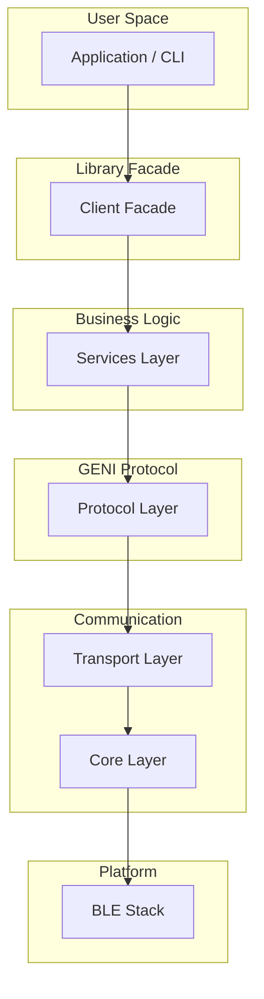

# Reimplementing ALPHA HWR in Your Language

This guide helps you implement the Grundfos ALPHA HWR protocol in any programming language. The Python implementation in this repository serves as a reference implementation with extensive documentation.

## Why This Guide?

The ALPHA HWR pump uses the GENI protocol over Bluetooth Low Energy (BLE). This guide provides:

- **Complete protocol specification** with byte-level details
- **Test vectors** to validate your implementation
- **Common pitfalls** and how to avoid them
- **Layer-by-layer implementation** guide
- **Working reference implementation** in Python

## Quick Start

1. **Read [Architecture Overview](architecture.md)** - Understand the system layers
2. **Follow [Layer-by-Layer Guide](layer_by_layer.md)** - Build your implementation step-by-step
3. **Use [Test Vectors](test_vectors.md)** - Validate each component
4. **Check [Common Pitfalls](common_pitfalls.md)** - Avoid known issues
5. **Track Progress with [Checklist](checklist.md)** - Ensure completeness

## Prerequisites

### Required Knowledge

- BLE (Bluetooth Low Energy) basics
- Async/concurrent programming in your language
- Binary data handling (byte arrays, bit manipulation)
- CRC-16/MODBUS checksums

### Hardware/Tools

- Grundfos ALPHA HWR pump (any variant)
- BLE-capable computer or device
- BLE debugging tools (nRF Connect, LightBlue, etc.)

## Implementation Approach

### Recommended Order

```
1. Core Layer (Authentication, Session, Transport)
   └─> Can connect, authenticate, send/receive packets
   
2. Protocol Layer (Codec, Frame Builder, Frame Parser)
   └─> Can encode/decode GENI protocol frames
   
3. Service Layer (Telemetry, Control, Device Info, etc.)
   └─> Can perform pump operations
   
4. Client Layer (High-level API)
   └─> Easy-to-use interface for applications
   
5. CLI/UI (Optional)
   └─> Command-line or graphical interface
```

### Minimal Implementation

For a minimal working implementation, you need:

1. **BLE Transport** - Connect to pump, send/receive data
2. **Authentication** - Send magic packets to unlock
3. **Frame Encoding/Decoding** - Build and parse GENI frames
4. **Telemetry Reading** - Read pump measurements
5. **Control Commands** - Start/stop, set mode

See [Checklist](checklist.md) for required vs. optional features.

## Architecture Overview

### Layered Design




### Concepts

#### 1. Authentication
The pump requires a specific sequence of "magic packets" to unlock:
- 3x Legacy Magic packets
- 5x Class 10 Unlock packets
- 2x Extend packets

See [02_authentication.md](../protocol/packet_traces/02_authentication.md) for details.

#### 2. GENI Protocol
All communication uses the GENI protocol format:
```
[Start] [Length] [ServiceID] [Source] [APDU...] [CRC-H] [CRC-L]
```

See [wire_format.md](../protocol/wire_format.md) for specification.

#### 3. Data Objects
The pump exposes data as "DataObjects" (Class 10):
- **Sub 0x5600**: Control commands (mode, setpoint)
- **Sub 0x0045**: Motor telemetry (speed, power, temp)
- **Sub 0x0122**: Flow/pressure telemetry
- **Sub 0x003C**: Device information

See [telemetry.md](../protocol/telemetry.md) for all objects.

#### 4. Big-Endian Floats
All float values are IEEE 754 big-endian (network byte order):
```python
# Example: 1.5 meters
bytes: 0x3FC00000
breakdown: 0x3F 0xC0 0x00 0x00
```

See [test_vectors.md](test_vectors.md) for test cases.

## Language-Specific Notes

### Python (Reference Implementation)
- Uses `bleak` for BLE
- Async/await with `asyncio`
- Pydantic for data models
- See `src/alpha_hwr/` for full code

### JavaScript/TypeScript
- Use Web Bluetooth API or `noble`
- Promise-based async
- DataView for binary handling
- See `core/codec.py` for portable examples

### Rust
- Use `btleplug` for BLE
- `tokio` for async
- `byteorder` crate for endianness
- Strong type system prevents many errors

### C/C++
- Platform-specific BLE libraries
- Manual memory management
- Use `htonl`/`ntohl` for endianness
- See authentication.py for pseudocode

### Go
- Use `tinygo-org/bluetooth` or `paypal/gatt`
- Goroutines for concurrency
- `encoding/binary` for byte order
- Struct tags for serialization

## Testing Your Implementation

### 1. Unit Tests
Test each layer independently:
- Codec: Encode/decode test vectors
- Frame Builder: Build valid packets
- Frame Parser: Parse example packets
- Services: Mock transport responses

### 2. Integration Tests
Test with real pump:
- Connect and authenticate
- Read telemetry
- Set control mode
- Read/write schedules

### 3. Validation
Use [test_vectors.md](test_vectors.md) to verify:
- CRC calculation correctness
- Float encoding/decoding accuracy
- Frame structure validity

## Example: Minimal Reader

Here's pseudocode for the simplest possible implementation:

```python
# 1. Connect to pump via BLE
device = connect_ble("ALPHA_XXXX")
tx_char = device.get_characteristic(TX_UUID)
rx_char = device.get_characteristic(RX_UUID)

# 2. Authenticate
for _ in range(3):
    tx_char.write(LEGACY_MAGIC)
for _ in range(5):
    tx_char.write(CLASS10_UNLOCK)
tx_char.write(EXTEND_1)
tx_char.write(EXTEND_2)

# 3. Request telemetry (motor state)
packet = build_info_command(class=0x0A, sub=0x0045, obj=0x0057)
tx_char.write(packet)

# 4. Parse response
response = rx_char.read()
frame = parse_frame(response)
grid_voltage = decode_float_be(frame.payload[0:4])
speed_rpm = decode_float_be(frame.payload[20:24])

print(f"Grid: {grid_voltage}V, Speed: {speed_rpm} RPM")
```

See [layer_by_layer.md](layer_by_layer.md) for complete details.

## Getting Help

### Resources
- **Protocol Docs**: [../protocol/architecture.md](../protocol/architecture.md)
- **Packet Traces**: [../protocol/packet_traces/01_connection.md](../protocol/packet_traces/01_connection.md)
- **Python Reference**: `src/alpha_hwr/` (see project root)
- **Common Issues**: [common_pitfalls.md](common_pitfalls.md)

### Questions?
- Check existing protocol documentation
- Review packet traces for examples
- Study Python implementation for clarity
- File issues in the GitHub repository

## Success Criteria

Your implementation should:

- [x] Connect to pump via BLE
- [x] Authenticate successfully
- [x] Read all telemetry values
- [x] Control pump (start/stop/mode)
- [x] Read device information
- [x] Handle errors gracefully
- [x] Match test vector outputs

Optional features:
- Schedule management
- Configuration backup/restore
- Historical data
- Advanced telemetry

## Next Steps

1. Read [Architecture Overview](architecture.md)
2. Start with [Layer-by-Layer Guide](layer_by_layer.md)
3. Implement core authentication
4. Test with [Test Vectors](test_vectors.md)
5. Build up to full functionality

Good luck with your implementation!
