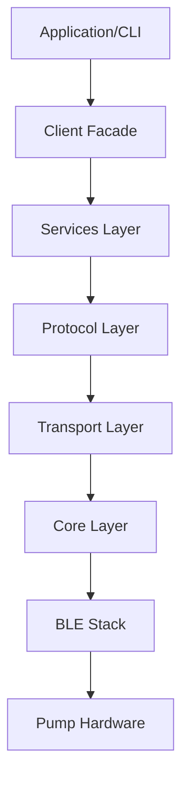
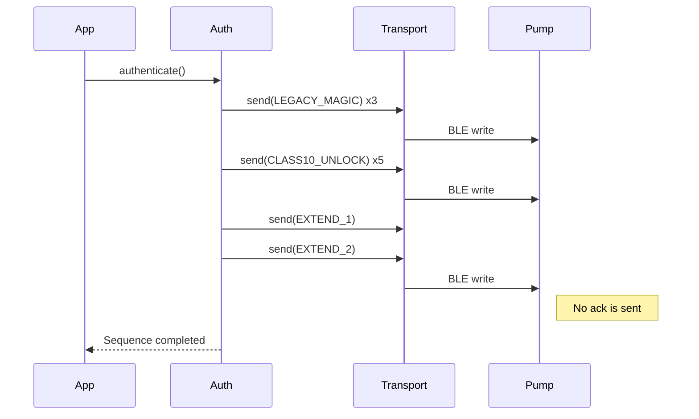
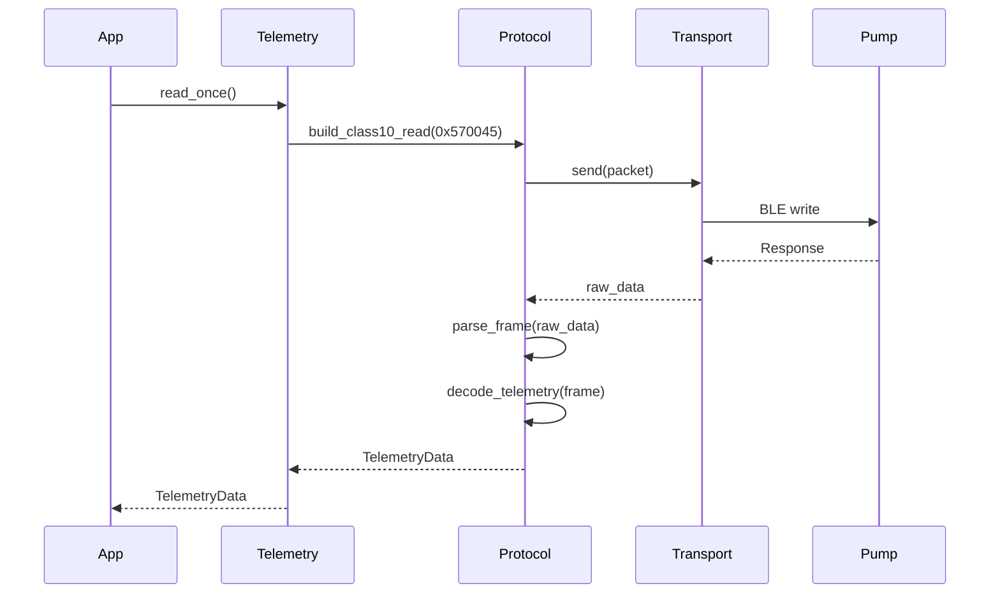
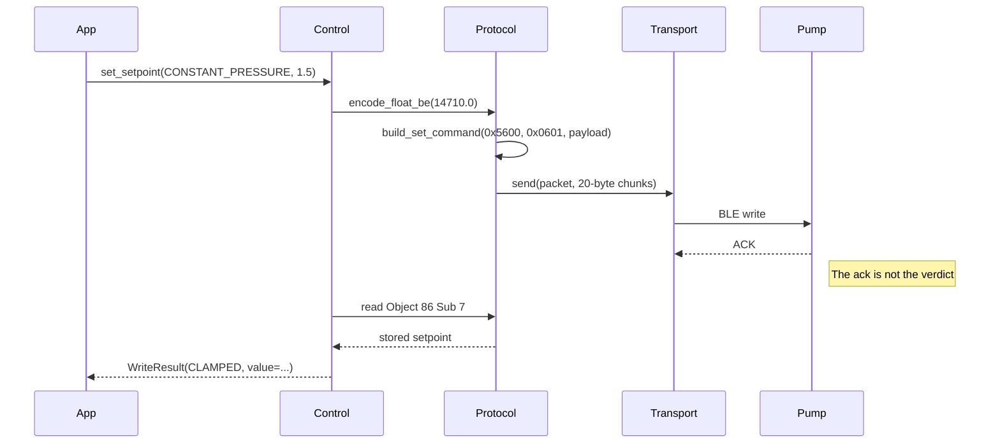
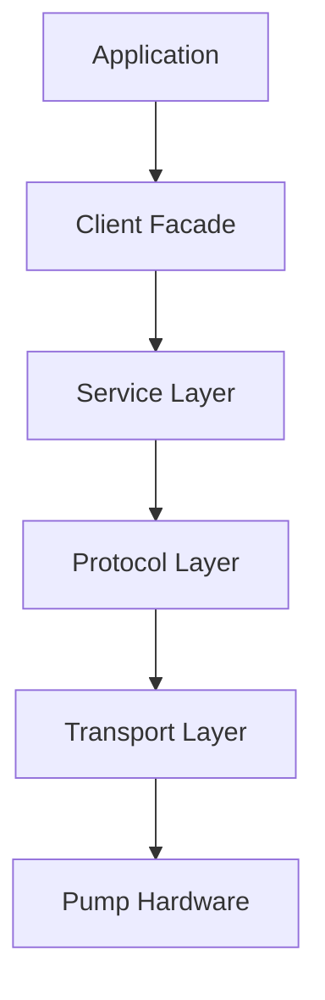
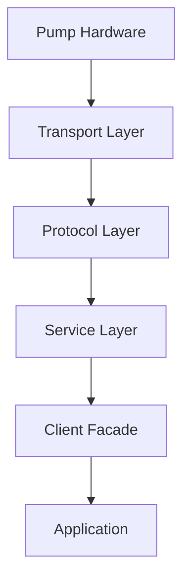
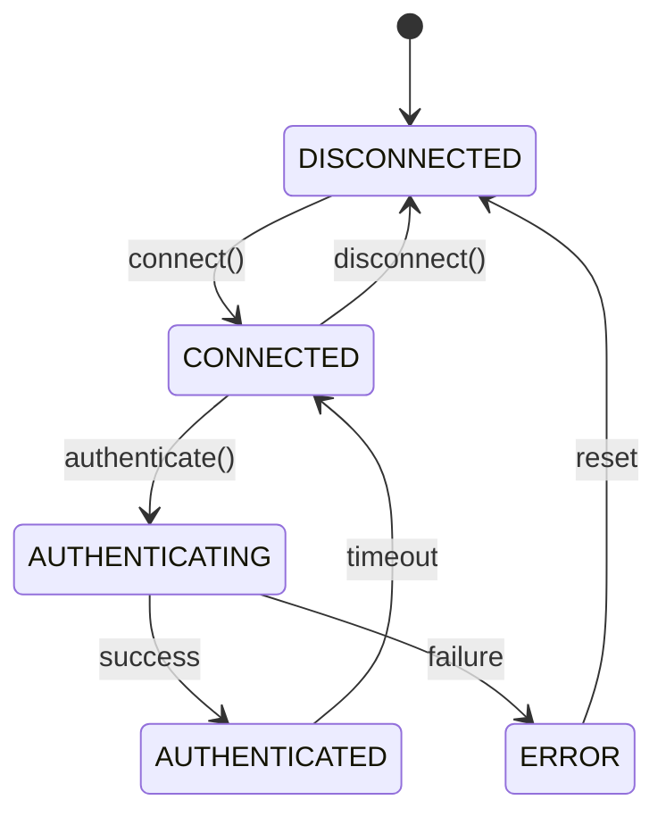
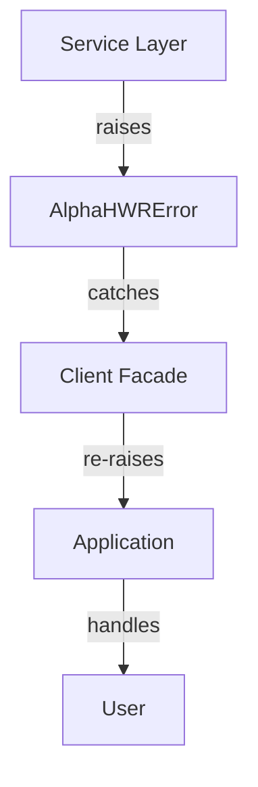

# Architecture Overview

This document provides a high-level architecture overview of the ALPHA HWR protocol implementation.

## System Architecture



## Layer Responsibilities

### 1. Core Layer
**Purpose**: Foundation for BLE communication and session management

**Components**:
- `authentication.py` - Authentication handshake
- `session.py` - Connection state machine
- `transport.py` - BLE send/receive abstraction

**Responsibilities**:
- Manage BLE connection lifecycle
- Execute authentication sequence
- Handle packet transmission/reception
- Maintain session state

### 2. Protocol Layer
**Purpose**: GENI protocol encoding/decoding

**Components**:
- `codec.py` - Primitive encoding/decoding (floats, ints)
- `frame_builder.py` - Construct GENI frames
- `frame_parser.py` - Parse GENI frames
- `telemetry_decoder.py` - Decode telemetry payloads

**Responsibilities**:
- Build valid GENI protocol packets
- Parse received packets
- Calculate CRC checksums
- Extract data from payloads

### 3. Services Layer
**Purpose**: Business logic for pump operations

**Components**:
- `telemetry.py` - Read measurements
- `control.py` - Pump control operations
- `device_info.py` - Device information
- `schedule.py` - Schedule management
- `configuration.py` - Backup/restore

**Responsibilities**:
- Expose high-level operations
- Handle complex multi-step workflows
- Validate inputs
- Manage service state

**A fifth service worth copying**: a **write layer**. The pump acknowledges
frames it is about to clamp — ask for 600 RPM and it stores 1650 — so an
ack-as-success design reports a state the pump is not in. Route every write
through one serialized path that reads the value back and reports what was
actually stored. In this implementation that is `write_operation.py`; the
C++ port has the same shape.

**Services may depend on other services.** A verified write has to read state
back through the service that owns it, so the write layer takes the control
service, and the control service takes the schedule service. Inject at
construction; forbid cycles, not composition.

### 4. Client Facade
**Purpose**: Simple unified API

**File**: `client.py`

**Responsibilities**:
- Single entry point for applications
- Manage service lifecycles
- Handle connection/disconnection
- Provide context manager interface

## Sequence Diagrams

### Authentication Sequence



### Telemetry Reading



### Control Mode Setting



## Data Flow

### Request Flow



### Response Flow



## State Management

### Session States



### Transport States

- **IDLE**: No active operation
- **SENDING**: Packet transmission in progress
- **WAITING**: Awaiting response
- **RECEIVING**: Processing notification
- **ERROR**: Communication failure

## Design Patterns

### 1. Layered Architecture
Each layer has clear boundaries and responsibilities. Upper layers depend only on adjacent lower layers.

### 2. Async/Await
All I/O operations are asynchronous to prevent blocking.

### 3. Context Managers
Resources (connections, sessions) use context managers for automatic cleanup.

### 4. Service Locator
Client facade provides access to all services through a single interface.

### 5. Strategy Pattern
Different control modes, schedule types, etc. use strategy pattern.

## Error Handling

### Error Propagation




### Error Types

- **ConnectionError**: BLE connection issues
- **AuthenticationError**: Authentication failure
- **ProtocolError**: Invalid packet or CRC
- **TimeoutError**: Operation timeout
- **ValidationError**: Invalid input

## Thread Safety

### Concurrent Access

- **Transport**: Uses asyncio locks for sequential command execution
- **Session**: Thread-safe state machine
- **Services**: Stateless operations (safe for concurrent use)

### Lock Hierarchy

```
Transport Lock (lowest)
  ↓
Session Lock
  ↓
Service Lock (highest)
```

Always acquire locks from highest to lowest to prevent deadlocks.

## Performance Considerations

### Latency
- Authentication: ~500ms
- Single telemetry read: ~100-200ms
- Control command: ~100-150ms

### Throughput
- BLE MTU: 20 bytes (default)
- Max packet size: ~250 bytes
- Notifications: Up to 1Hz from pump

### Resource Usage
- Memory: Minimal (< 1MB for client)
- CPU: Low (BLE and parsing only)
- Battery: Dependent on connection interval

## Security

### Authentication
- Custom challenge-response using magic packets
- No encryption at application layer
- Relies on BLE pairing for security

### Data Privacy
- Telemetry data sent in clear text over BLE
- Recommend BLE pairing for sensitive deployments

## Extensibility

### Adding New Services

1. Create service class in `services/`
2. Add to `client.py` facade
3. Document in guides
4. Add tests

### Adding New Commands

1. Define in `protocol/frame_builder.py`
2. Parse in `protocol/frame_parser.py`
3. Expose in relevant service
4. Add test vectors

### Supporting New Pumps

1. Verify GENI protocol compatibility
2. Update constants if needed
3. Add pump-specific tests
4. Document differences

## Testing Strategy

### Unit Tests
- Each layer tested independently
- Mock dependencies
- Test vectors for validation

### Integration Tests
- End-to-end with mock pump
- Real hardware tests
- Cross-platform validation

### Reference Tests
- Portable test suite
- Byte-level validation
- Other languages can use same tests

## Deployment

### Packaging
- Python: PyPI package
- JavaScript: npm package
- Rust: crates.io
- Others: Language-specific registries

### Dependencies
- BLE library (Bleak, noble, btleplug, etc.)
- Async runtime (asyncio, tokio, etc.)
- Optional: CLI framework, GUI toolkit

## Next Steps

1. Review [Layer-by-Layer Guide](layer_by_layer.md) for implementation details
2. Use [Checklist](checklist.md) to track progress
3. Validate with [Test Vectors](test_vectors.md)
4. Check [Common Pitfalls](common_pitfalls.md) for known issues
